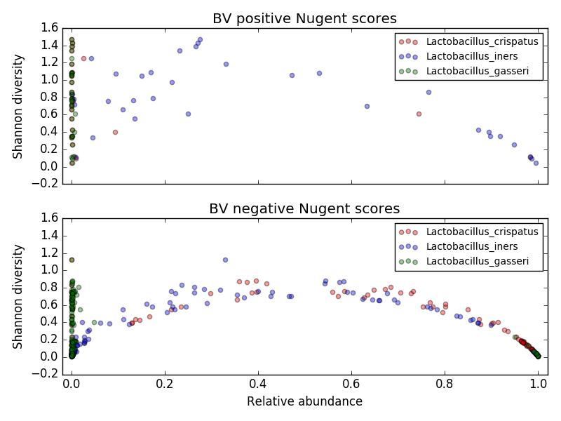

# Homework 10
In this assignment you will make plots from the OTU relative abundances and metadata from previous assignments. 

## Things to do before midnight, **12/8**, or Sooner ##

Write a program called *plots2.py* that uses matplotlib (either directly or via pandas) to create some plots/charts to analyze microbiome data from the merged datasets in Homework 8. For convenience, a tab-delimited dataset with the merged information from each datapoint is in *Homework/resources/summaryByDay_merged.txt*. Save the plots in png files named *LG_diversity.png* and (optionally) *LG_std.png* (respectively for each step 1--2 below.)

1. For each data point, plot the first three *Lactobacillus* species (*Lactobacillus crispatus*, *Lactobacillus iners*, and *Lactobacillus gasseri*) relative abundances against Shannon diversity in two subplots, one for days with Nugent scores indicating positive BV (*score* in the range 7--10) and one for Nugent scores that are definitively negative for BV (*score* in the range 0--3). 

	

	NOTE: I tried to solve this with *Pandas.plot()*, but could not get the x axis label to work properly. This is what I got:

	

	This plot has the following parameters:

Parameter 	| Value (notes)
----------------------	| ------------------
x limits	| range from -0.2 to 1.02 (so that points on ends aren't crowded)
Font sizes	| title: large, labels: medium, legend text: small
alpha	| 0.4 (this makes the points semi-transparent, so they don't cover each other up)
colors	| red, blue, green, yellow

2. (extra credit) Plot *average* (over all data points) relative abundances for each of the three *Lactobacillus* species in a bar plot, with  one set of bars for days with  positive BV (*score* in the range 7--10) and one for definitively negative scores y for BV (*score* in the range 0--3), with error bars of plus or minus one standard deviation. 

	

Parameter 	| Value (notes)
----------------------	| ------------------
y limits	| range from 0 to 1
Font sizes	| just use defaults
alpha	| 0.5
colors	| defaults

It may be very likely that you will need to transpose some dataframes (by using the *DataFrame.Transpose* object). You will also need the *yerr=[[x][y]]* parameter, where x and y are lists fo the positive and negative errors (+/- one std here). 

Hint: this may be easier if you create a dataframe with means and stds for both BV positive and BV negative data, then plot on the means columns and pull the yerr values from the std columns.

## Turn in homework
1. Commit your work
2. Update your local master
3. Sync with the remote master (that is how we will turn in homework!).
## Grading
Grades will be determined as follows:

Grade | Criteria 
-------- | --------------
0          | Nothing turned in
1          | *plots2.py*  turned in but doesn't run, or is incorrect
2          | *plots2.py* accurate and figures correctly formatted
3          | Code uses good style or correct answer for last (extra credit) task in addition to criteria for grade of 2