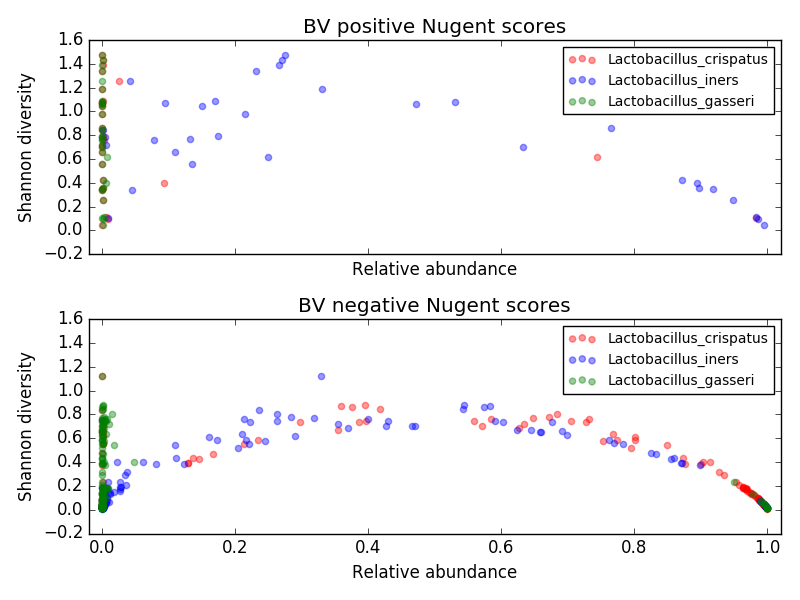
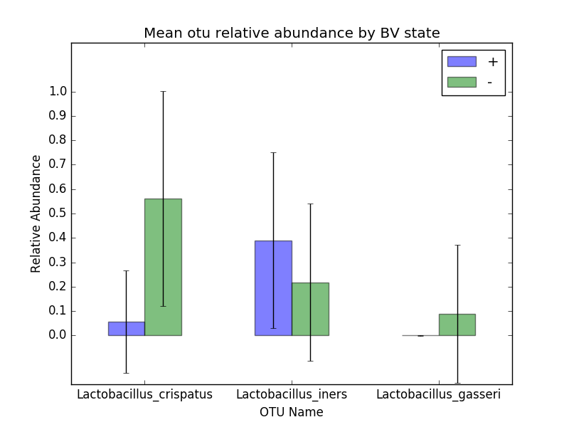

# Homework 10: ****DRAFT**** 

**NOTE: This is not the actual assignment yet!**

In this assignment gives you will make plots from the OTU relative abundances and metadata from previous assignments. 

## Things to do before midnight, **12/8**, or Sooner ##

Write a program called *plots2.py* that uses matplotlib (either directly or via pandas) to create some plots/charts to analyze microbiome data from the merged datasets in Homework 8. For convenience, a tab-delimited dataset with the merged information from each datapoint is in *Homework/resources/summaryByDay_merged.txt*. Save the plots in png files named *LG_diversity.png* and (optionally) *LG_std.png* (respectively for each step 1--2 below.)

1. For each data point, plot the first three *Lactobacillus* species (*Lactobacillus crispatus*, *Lactobacillus iners*, and *Lactobacillus gasseri*) relative abundances against diversity metric in two subplots, one for days with Nugent scores indicating positive BV (*score* in the range 7--10) and one for Nugent scores that are definitively negative for BV (*score* in the range 0--3). 

	

2. (extra credit) plot *average* (over all data points) relative abundance for each of the three *Lactobacillus* species versus diversity metrics in two subplots, one for days with Nugent scores indicating positive BV (*score* in the range 7--10) and one for Nugent scores that are definitively negative for BV (*score* in the range 0--3), **with error bars of plus or minus one standard deviation**. 

	

## Turn in homework
1. Commit your work
2. Update your local master
3. Sync with the remote master (that is how we will turn in homework!).
## Grading
Grades will be determined as follows:

Grade | Criteria 
-------- | --------------
0          | Nothing turned in
1          | *plots2.py*  turned in but doesn't run, or is incorrect
2          | *plots2.py* accurate and figures correctly formatted
3          | Code uses good style or correct answer for last (extra credit) task in addition to criteria for grade of 2