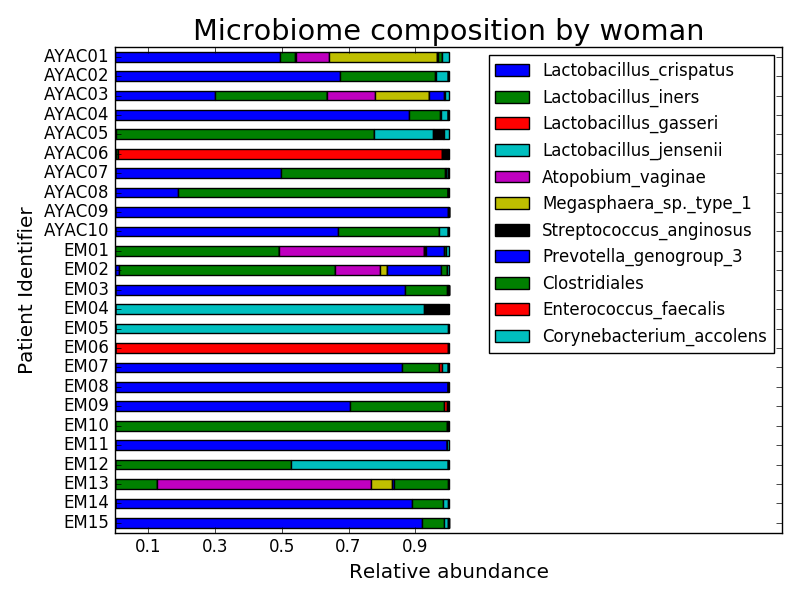
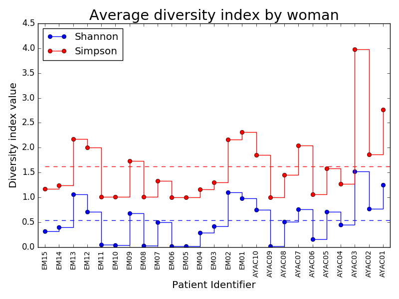

# Homework 9: ****DRAFT**** 

**NOTE: This is not the actual assignment yet!** I'm posting it for those of you who might want to get started anyway.

In this assignment gives you will make plots from the OTU relative abundances and metadata from previous assignments. 

## Things to Do by midnight, **12/1**, or Sooner ##

Write a program called *plots.py* that uses matplotlib to create some plots/charts to analyze microbiome data from previous assignments (do what you need to to get the data into a usable format). For each of these, either turn in all work in a jupyter notebook or create separate png files named *MicrobiomeByWoman.png* and *DiversityByWoman.png* (respectively for each step 1--2 below, and *DiversityAllData.png* for step 3.)

1. Make horizontal stacked barcharts of each woman's microbiome that looks like this (pay attention to titles and axis lables). Data are from HW7, *summaryByWoman.txt*, and I have put a copy in the *Homework/Resources* directory. Save figure to *MicrobiomeByWoman.png* (note, that is a png file). 

2. Plot average Shannon and Simpson diversity indexes in blue and red, respectively,  by woman. Add dotted horizontal line in the same color for the mean average index. Data are in *Homework/Resources/summaryByWoman.txt*. Save figure to *DiversityByWoman.png* (note, that is a png file). 

3. (extra credit) Plot histogram of Shannon diversity scores for all the data. Data are in  *Resources/summaryByDay.txt*. Save figure to *DiversityAllData.png* (note, that is a png file).

	
## Turn in homework
1. Commit your work
2. Update your local master
3. Sync with the remote master (that is how we will turn in homework!).
## Hints and Suggestions ##

* if you increase the xlim setting, you will get more room on the right of your bars in (1)
* Font sizes are:

Font size | item
--------------------	| ---------
title	| xx-large
x, y lables 	| large
legend 	| medium

## Grading
Grades will be determined as follows:

Grade | Criteria 
-------- | --------------
0          | Nothing turned in
1          | *plots.py*  turned in but doesn't run, or is incorrect, or figures turned in but they don't meet the specifications
2          | *plots.py* accurate and figures correctly formatted
3          | Code uses good style. Or does extra credit question